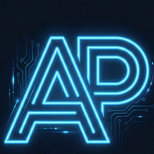
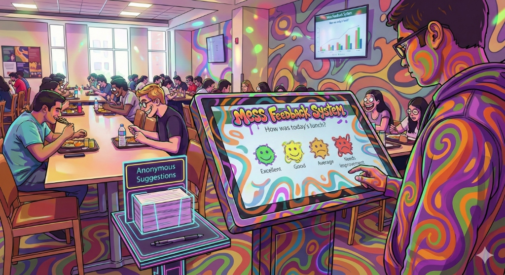
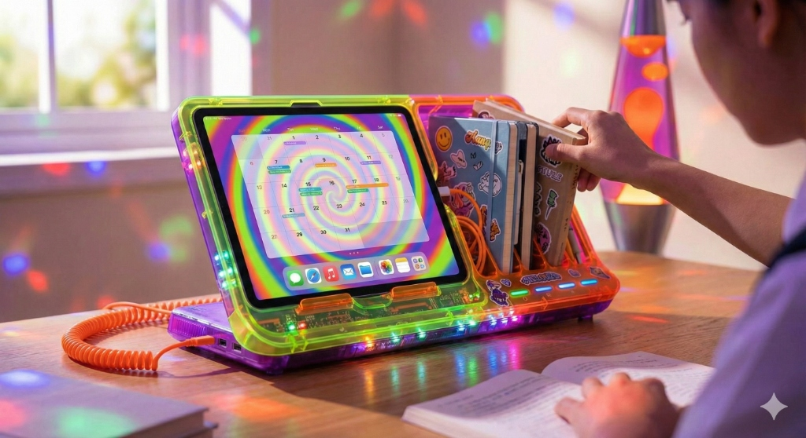
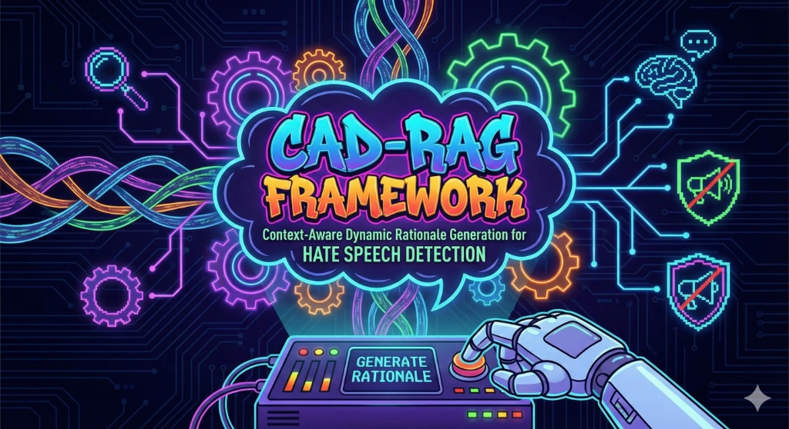
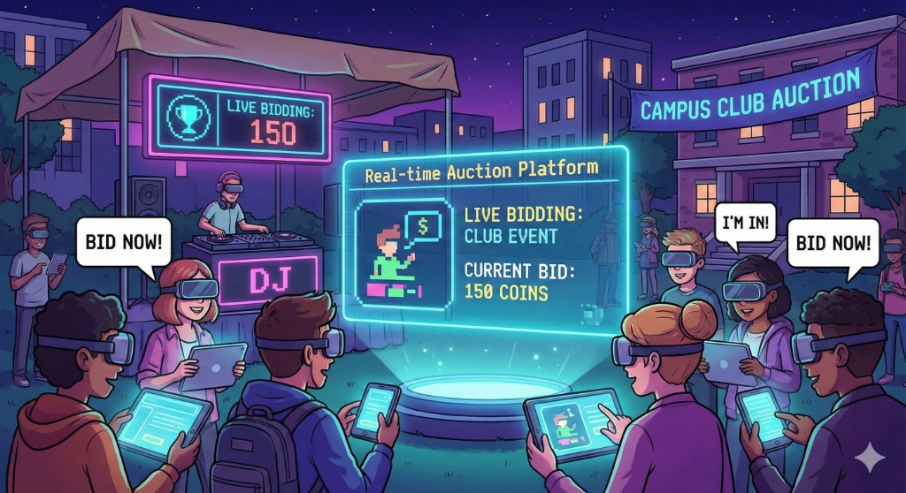

<p align="center">
  
</p>

<h1 align="center">Arnav Pratap — Portfolio</h1>

<p align="center">
  <strong>A premium, minimal, 120Hz-smooth personal portfolio showcasing my work, skills, and projects.</strong>
</p>

<p align="center">
  <a href="#features">Features</a> •
  <a href="#tech-stack">Tech Stack</a> •
  <a href="#sections">Sections</a> •
  <a href="#run-locally">Run Locally</a> •
  <a href="#contact">Contact</a>
</p>

---

## 👋 About Me

I'm **Arnav Pratap** — a **Full Stack Developer**, **AI/ML Explorer**, and **UI/UX Enthusiast** passionate about crafting elegant solutions and building impactful digital experiences. This portfolio represents my work, achievements, and personality through a clean, premium dark UI.

---

## 🔥 Website Preview

<p align="center">
  
</p>

---

## ✨ Features

| Feature | Description |
|---------|-------------|
| 🎨 **Premium Dark UI** | Minimal, elegant dark theme with gradient accents |
| 🚀 **120Hz-Smooth Animations** | GPU-accelerated transitions with Framer Motion |
| 🌀 **Custom Background Effects** | Vortex particles, Aurora background, Floating bubbles |
| 🖱️ **Interactive Elements** | Magnetic hover effects, cursor-responsive glows |
| 📱 **Fully Responsive** | Optimized for all screen sizes |
| ⚡ **Performance Optimized** | Lazy loading, debounced events, minimal re-renders |
| 🎯 **Floating Navigation** | Smart navbar with active section detection |
| ✨ **Micro-Animations** | Breathing effects, skill loops, staggered reveals |

---

## 📂 Sections

| Section | Highlights |
|---------|------------|
| **Hero** | Animated intro with skill rotation, profile photo with cursor glow |
| **About (Technical Arsenal)** | Interactive skill grid with 25+ technologies |
| **Experience** | Timeline with animated reveals |
| **Projects** | Narrative project cards with hover effects |
| **Contact** | Social links and connection options |

---

## 🛠️ Tech Stack

### Core
- **Next.js 16** — React framework with App Router
- **React 19** — Latest React with concurrent features
- **TypeScript** — Type-safe development

### Styling & Animation
- **Tailwind CSS** — Utility-first styling
- **Framer Motion** — Production-ready motion library
- **Lenis** — Smooth scroll library

### UI Components (25+ Custom)
```
├── Vortex              — Particle background animation
├── Aurora Background   — Gradient aurora effect
├── Floating Bubbles    — Interactive bubble animation
├── Magnetic Pulse      — Magnetic hover effects
├── Tracing Beam        — Scroll progress indicator
├── Narrative Cards     — Project showcase cards
├── HyperText           — Scramble text effect
├── Animated Skill Grid — Interactive technology grid
├── And many more...
```

### Additional Libraries
- **tsParticles** — Particle system
- **Lucide React** — Icon library
- **Tabler Icons** — Additional icons

---

## 🚀 Run Locally

```bash
# Clone the repository
git clone https://github.com/Arnavpratap2004/portfolio.git

# Navigate to the project
cd portfolio

# Install dependencies
npm install

# Start development server
npm run dev
```

Open [http://localhost:3000](http://localhost:3000) in your browser.

### Build for Production

```bash
npm run build
npm run start
```

---

## 🧪 Performance Optimizations

- ✅ **Lazy-loaded components** — Reduced initial bundle size
- ✅ **GPU-accelerated animations** — `transform: translateZ(0)` for smooth renders
- ✅ **Debounced scroll events** — Optimized event handlers
- ✅ **Optimized particle counts** — Balanced visual appeal and performance
- ✅ **Will-change hints** — Browser compositor layer hints
- ✅ **Image optimization** — Next.js automatic image optimization

---

## 📸 Project Highlights

<table>
  <tr>
    <td align="center">
      <br />
      <strong>Mess Feedback System</strong><br />
      <em>500+ Daily Users</em>
    </td>
    <td align="center">
      <br />
      <strong>Smart Study Organizer</strong><br />
      <em>AWS-Powered AI</em>
    </td>
  </tr>
  <tr>
    <td align="center">
      <br />
      <strong>CAD-RAG Framework</strong><br />
      <em>IIT Research Project</em>
    </td>
    <td align="center">
      <br />
      <strong>Real-time Auction Platform</strong><br />
      <em>200+ Concurrent Users</em>
    </td>
  </tr>
</table>

---

## 📬 Contact

<p align="center">
  <a href="https://github.com/Arnavpratap2004"></a>
  <a href="https://linkedin.com/in/arnavpratap2004"></a>
</p>

---

## 🙌 Acknowledgements

- Design inspiration from **Dribbble**, **Behance**, and premium dark UI concepts
- UI components inspired by **Aceternity UI** patterns
- Icon libraries: **Lucide**, **Tabler Icons**, **Devicons**

---

<p align="center">
  <strong>⭐ Star this repo if you find it inspiring!</strong>
</p>

<p align="center">
  Made with 💜 by <strong>Arnav Pratap</strong>
</p>
