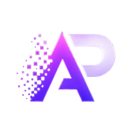
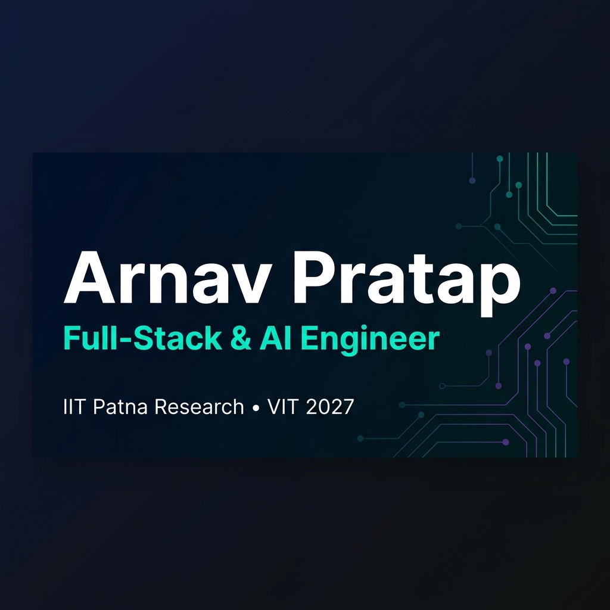

<p align="center">
  
</p>

<h1 align="center">Arnav Pratap — Portfolio</h1>

<p align="center">
  A dark, cinematic personal portfolio built with Next.js 16 and hand-written WebGL backgrounds,
  <br />tuned to hold 60fps on integrated graphics.
</p>

<p align="center">
  <a href="https://arnavpratap.tech"><strong>Live site → arnavpratap.tech</strong></a>
</p>

<p align="center">
  
  
  
  
  
  
</p>

<p align="center">
  
</p>

---

## Overview

This is my personal portfolio — the place I point people to when they ask what I build. It's a
single-page experience with an animated intro, a WebGL neural background, an interactive skills
grid, a scroll-driven project showcase, and a working contact form that emails me and auto-replies
to the sender.

I'm a final-year CSE student at VIT (9.00 CGPA) and a two-time research intern at IIT Patna working
on NLP and multi-agent LLM systems. I care a lot about the details — motion that feels intentional,
and a page that stays smooth even on a laptop without a discrete GPU.

## Highlights

- **Cinematic intro loader** — a neural web grows from the core, implodes at 100%, and detonates into a supernova as the site reveals.
- **Split hero** — animated name typing, rim-lit portrait, floating capability chips, and a slow orbital ring.
- **Technical Arsenal** — a skills grid with per-category accent colours, cursor-tracking 3D tilt, and proficiency meters.
- **Experience & Education timeline** — scroll-synced year markers over an animated line-wave field.
- **Selected Projects** — an orbital, scroll-driven carousel on desktop that falls back to clean cards on mobile.
- **Working contact form** — Resend-powered, with a formatted notification email and an automatic reply to the sender.
- **Details** — a custom gradient scrollbar, brand-matched favicon, glassmorphism navbar, and full reduced-motion support.

## Tech Stack

| Area | Tools |
|------|-------|
| **Framework** | Next.js 16 (App Router), React 19, TypeScript |
| **Styling** | Tailwind CSS, CSS Modules |
| **Animation** | Framer Motion, Lenis (smooth scroll) |
| **Graphics** | Three.js + OGL (custom GLSL shaders), Canvas 2D |
| **Backend** | Next.js Route Handlers, Resend (transactional email) |
| **Forms** | React Hook Form |
| **Icons** | Tabler Icons, Lucide, Devicons |
| **Tooling** | ESLint, Sharp (image pipeline), Vercel |

## Architecture & Performance

Every background on this site is hand-written — no drop-in libraries — so I could tune exactly how
much work happens per frame. The whole thing is built to stay at 60fps on integrated graphics, which
took some deliberate engineering:

- **Scroll-gated rendering** — a single `is-scrolling` class on `<html>` pauses or down-scales every ambient canvas (neural field, glass background, line waves) while the page is moving, handing the full frame budget to scrolling.
- **Idle pre-mounting** — below-the-fold sections mount and compile their shaders during post-load idle time, so nothing heavy first-paints mid-scroll.
- **Throttled decorative renderers** — WebGL backgrounds run below display refresh rate (24–30fps) at reduced device-pixel ratios, where the slow motion is imperceptible but the savings are not.
- **Composited-only motion** — animations stick to `transform`/`opacity`; no `backdrop-filter` or `filter` animates over moving content.

I profiled these on an Intel UHD iGPU with a headless-Chrome frame recorder rather than guessing.

## Project Structure

```
.
├── app/
│   ├── api/contact/route.ts   # Resend contact endpoint (notify + auto-reply)
│   ├── layout.tsx             # Fonts, metadata, JSON-LD, providers
│   ├── page.tsx              # Section composition + lazy mounting
│   ├── globals.css           # Design tokens, scrollbar, keyframes
│   └── favicon.ico
├── components/
│   ├── sections/             # Hero, About, Experience, Projects, Footer
│   ├── contact/              # Contact section, form, and media
│   └── ui/                   # Loaders, navbar, WebGL backgrounds, skill grid
├── lib/                      # Shared utilities
└── public/                   # Images, fonts, video, resume
```

## Getting Started

**Prerequisites:** Node.js 18.18+ and npm.

```bash
# 1. Clone
git clone https://github.com/Arnavpratap2004/Arnav_Portfolio.git
cd Arnav_Portfolio

# 2. Install
npm install

# 3. Environment — create .env.local
echo "RESEND_API_KEY=your_resend_api_key" > .env.local

# 4. Run
npm run dev
```

Open [http://localhost:3000](http://localhost:3000).

> The `RESEND_API_KEY` is only needed for the contact form. The rest of the site runs without it.

### Production

```bash
npm run build
npm run start
```

## Featured Projects

| Project | Description | Repo |
|---------|-------------|------|
| **CAD-RAG Framework** | Context-aware dynamic RAG for zero-day hate-speech detection (IIT Patna, IEEE paper) | [Code](https://github.com/Arnavpratap2004/HateSpeech_using_CAD-RAG) |
| **StockSense** | Role-based inventory dashboard with real-time tracking and Recharts analytics | [Code](https://github.com/Arnavpratap2004/StockSense) |
| **Homelia** | Full-stack home-decor e-commerce platform with RBAC and cart management | [Code](https://github.com/Arnavpratap2004/Homelia) |
| **Study-Mate** | AI document organiser using AWS Textract, Comprehend, S3, and DynamoDB | [Code](https://github.com/Arnavpratap2004/Study-Mate) |
| **Mess Feedback System** | Campus-wide feedback platform serving 500+ students daily | [Code](https://github.com/Arnavpratap2004/Mess_Feedback_System) |
| **Auction Platform** | Real-time WebSocket bidding handling 200+ concurrent users | [Code](https://github.com/Arnavpratap2004/Auction-Platform) |

## Contact

- **Website** — [arnavpratap.tech](https://arnavpratap.tech)
- **Email** — [arnavpratap2003@gmail.com](mailto:arnavpratap2003@gmail.com)
- **LinkedIn** — [in/arnavpratap2004](https://www.linkedin.com/in/arnavpratap2004/)
- **GitHub** — [@Arnavpratap2004](https://github.com/Arnavpratap2004)

---

<p align="center">
  Designed and built by Arnav Pratap.
</p>
